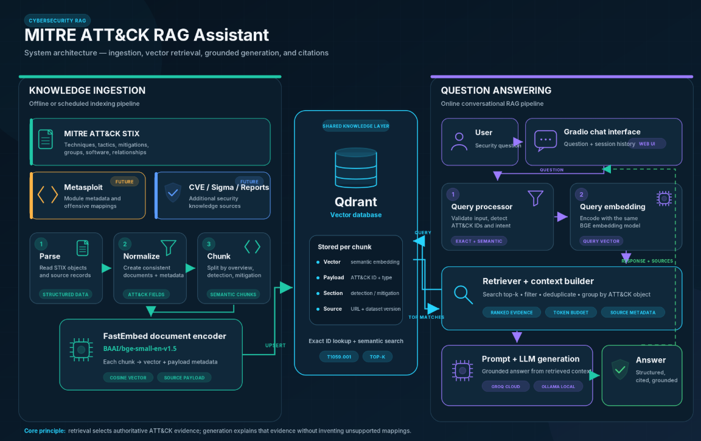
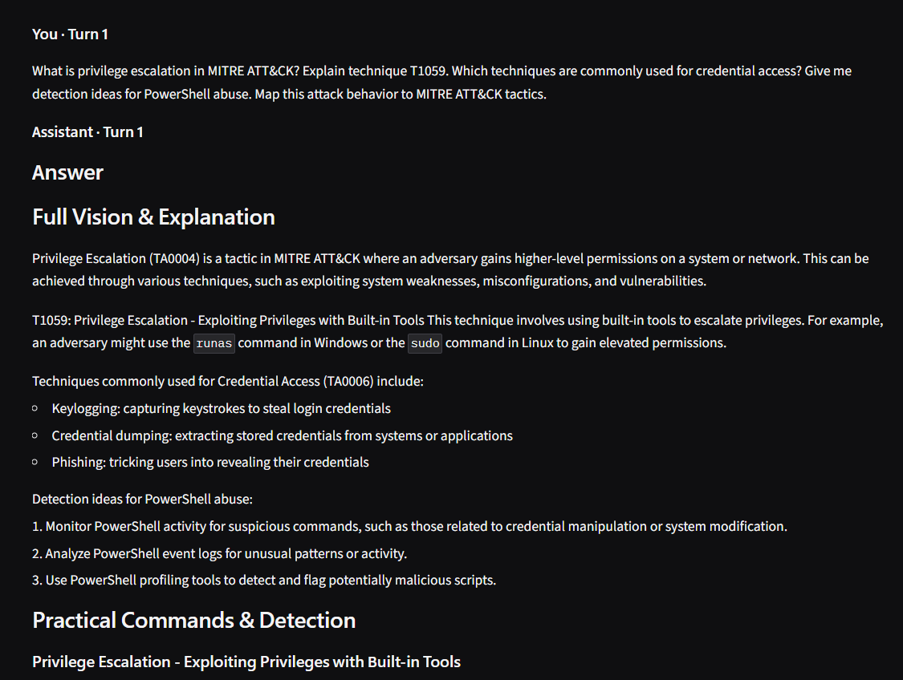

# MITRE ATT&CK RAG Assistant



A cybersecurity-focused Retrieval-Augmented Generation (RAG) assistant designed to help users explore, understand, and query the MITRE ATT&CK framework through a conversational interface.

The assistant combines semantic search, vector databases, and Large Language Models to provide fast, contextual, and structured answers about adversary tactics, techniques, procedures, threat behavior, and security operations. It is designed for cybersecurity students, SOC analysts, threat intelligence researchers, red teamers, and blue team practitioners who need a practical way to interact with ATT&CK knowledge.

---

## Demo



Example questions:

```text
What is privilege escalation in MITRE ATT&CK?
Explain technique T1059.
Which techniques are commonly used for credential access?
Give me detection ideas for PowerShell abuse.
Map this attack behavior to MITRE ATT&CK tactics.
```

---

## Project Overview

The MITRE ATT&CK RAG Assistant is built to transform static cybersecurity knowledge into an interactive AI assistant. Instead of manually searching through large ATT&CK datasets, users can ask natural-language questions and receive relevant, context-aware answers based on retrieved knowledge.

The system uses a Retrieval-Augmented Generation pipeline:

1. Cybersecurity knowledge is collected from structured ATT&CK data.
2. Documents are processed and embedded using semantic embeddings.
3. Embeddings are stored inside a Qdrant vector database.
4. User questions are converted into vectors and matched with the most relevant ATT&CK content.
5. A Large Language Model generates an answer based on the retrieved context.

---

## Knowledge Sources

This project is designed to work with trusted cybersecurity knowledge bases, including:

### MITRE ATT&CK Database

The MITRE ATT&CK framework is a globally used knowledge base of adversary tactics, techniques, and procedures based on real-world observations.

GitHub dataset:

[MITRE ATT&CK STIX Data](https://github.com/mitre-attack/attack-stix-data)

Additional MITRE CTI repository:

[MITRE CTI Repository](https://github.com/mitre/cti)

### Metasploit Database / Modules

Metasploit provides a large collection of exploit, auxiliary, post-exploitation, payload, encoder, and evasion modules used for penetration testing and security research.

GitHub repository:

[Metasploit Framework](https://github.com/rapid7/metasploit-framework)

Metasploit modules directory:

[Metasploit Modules](https://github.com/rapid7/metasploit-framework/tree/master/modules)

Future versions of this assistant can integrate Metasploit module metadata to enrich responses with offensive security context, exploit references, and practical penetration testing mappings.

---

## Features

- **MITRE ATT&CK Knowledge Retrieval**  
  Query adversary tactics, techniques, procedures, mitigations, detections, and threat behavior.

- **RAG-Based Cybersecurity Assistant**  
  Uses Retrieval-Augmented Generation to produce grounded responses based on retrieved security knowledge.

- **Qdrant Vector Search**  
  Stores and retrieves embedded cybersecurity documents efficiently using semantic similarity search.

- **Multiple LLM Backends**  
  Supports local models through Ollama and cloud inference through Groq APIs.

- **High-Performance Embeddings**  
  Uses `BAAI/bge-small-en-v1.5` through FastEmbed for accurate semantic search.

- **Modern Web Interface**  
  Built with Gradio to provide a simple, responsive, and interactive chatbot experience.

- **Expandable Security Knowledge Base**  
  Designed to support additional datasets such as Metasploit modules, CVE data, exploit references, and detection rules.

---

## Architecture


```text
User Question
     |
     v
Gradio Chat Interface
     |
     v
Embedding Model
     |
     v
Qdrant Vector Store
     |
     v
Relevant MITRE ATT&CK Context
     |
     v
LLM Generation
     |
     v
Context-Aware Cybersecurity Answer
```

---

## Tech Stack

- Python
- Gradio
- Qdrant
- FastEmbed
- BAAI/bge-small-en-v1.5
- Groq API
- Ollama
- MITRE ATT&CK STIX Data
- Metasploit Framework Data

---

## Prerequisites

- Python 3.8+
- Ollama, if using local models
- Groq API key, if using Groq inference
- Qdrant client
- Internet connection for downloading datasets and models

---

## Installation

1. Clone the repository:

```bash
git clone https://github.com/rihem-bs02/attack-rag-assistant.git
cd attack-rag-assistant
```

2. Install the required dependencies:

```bash
pip install gradio qdrant-client fastembed pandas requests python-dotenv
```

3. Create a `.env` file in the root directory:

```env
GROQ_API_KEY=your_groq_api_key_here
```

---

## Usage

1. Start the assistant:

```bash
python app6.py
```

2. Open the local Gradio URL in your browser:

```text
http://127.0.0.1:7860
```

3. Ask cybersecurity questions related to MITRE ATT&CK, threat behavior, attack techniques, mitigations, or detection ideas.

---

## Example Use Cases

- Learning MITRE ATT&CK tactics and techniques
- Mapping attack behavior to ATT&CK techniques
- Supporting SOC investigation workflows
- Generating detection and mitigation ideas
- Assisting cybersecurity students and researchers
- Enriching red team and blue team analysis
- Exploring future integration with Metasploit modules

---

## Future Improvements

- Add Metasploit module ingestion and indexing
- Map Metasploit modules to MITRE ATT&CK techniques
- Add CVE and exploit database integration
- Support PDF and custom security report ingestion
- Add authentication for private deployments
- Improve answer citations and source tracking
- Add export options for reports and investigation notes

---

## Screenshots

### Chat Interface


### Example Answer


### Vector Search / Retrieval Flow


---

## Repository Structure

```text
attack-rag-assistant/
│
├── app6.py
├── .env
├── README.md
├── assets/
│   ├── banner.png
│   ├── demo-interface.png
│   ├── architecture.png
│   ├── chat-interface.png
│   ├── example-answer.png
│   └── retrieval-flow.png
```

---

## Disclaimer

This project is intended for educational, research, and authorized cybersecurity purposes only. Any integration with offensive security tools such as Metasploit should be used only in legal environments where explicit permission has been granted.

---

## Author

Developed by [Rihem](https://github.com/rihem-bs02)
